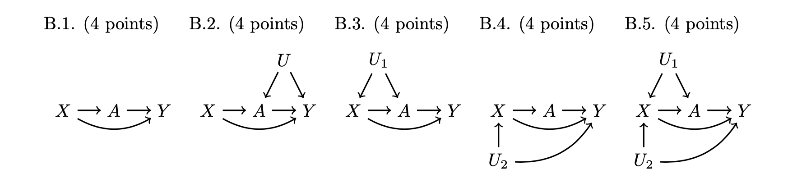

# Problem Set 4. Intervening to Equalize Opportunity

**Info 3370. Studying Social Inequality with Data Science. Spring 2023**

**Due: 5pm on 21 Apr 2023. Submit on
[Canvas](https://canvas.cornell.edu/courses/51595).**

Welcome to the fourth problem set! This problem set is about causal inference methods to study an intervention (a college degree) that might help to equalize economic opportunity.

- Before you begin, you download and unzip [**pset4.zip**](https://info3370.github.io/assets/assignments/pset4.zip). This contains several files that will be put in one working directory. Use the included .Rmd to complete the assignment
- In Canvas, you will upload the PDF produced by your .Rmd file
- Don’t put your name on the problem set. We want anonymous grading to be possible
- We’re here to help! Reach out using Ed Discussion or office hours

The header of this problem set has a few steps to get you set up, which we have streamlined as much as possible so you can focus on the causal problems.

## Data access

This problem set uses data from the National Longitudinal Survey of Youth 1997 (NLSY97). The NLSY97 began with a probability sample of U.S. non-institutionalized youths ages 12--17 in 1997, and has followed them in repeated interviews through 2019. 

To access data, you will

1. Visit the [**NLS Investigator**](https://www.nlsinfo.org/investigator/pages/search#) and register for an account
2. Log in. Choose the NLSY97 study and the substudy "NLSY97 1997--2019 (rounds 1--19)."
3. Under "Choose Tagsets", find where it says "Upload Tagset." Click "Choose File" and upload our tagset: `    pset4.NLSY97`, which is part of the zipped folder you downloaded for this problem set. This will load the variables we will use into your session.
4. Click "Save/Download" -> "Advanced Download". Check the box for "R Source code" and any other boxes you want. In the filename box, type "pset4" and click "Download."
5. Move the downloaded file `pset4.dat` into the unzipped folder you downloaded for this problem set

Note: The file you download will be under 200KB.

## Data preparation

You've done data preparation in previous homework, so we don't want that to take your time now. We made some code to help. Put your downloaded `pset4.dat` file in the directory where this .Rmd is located. The code below will prepare a data file for you.

```{r, comment = F, message = F}
library(tidyverse)
source("pset4_prep.R")

head(d)

```

The resulting data file `d` contains several variables:

- `respondent_college` is our treatment. It indicates whether the respondent completed a four-year college degree
- `fulltime_2019` is the outcome variable, which indicates whether the respondent was employed at least 30 hours per week at the time of the 2019 interview
- `sex` coded `Female` and `Mle`
- `race` coded `Black`, `Hispanic`, `White / Other`
- `parent_college` indicates whether the respondent's parent completed college
- `mom_age_at_birth` is the respondent's mother's age at the birth of the respondent
- `children_under_18` is the number of children under 18 in the respondent's household in the 1997 survey
- `two_parent_household` indicates whether the parent lived with two residential parents in 1997, where parent is defined to include non-biological residential parents
- `region` is coded in four U.S. regions for residence in 1997
- `urban` indicates residence in an urban area in 1997
- `income_1997` is gross household income in 1997

# Part 1 (10 points). Nonparametric estimation

We will estimate the causal effect of the respondent completing college on whether that respondent works full-time in the 2019 interview. To practice nonparametric estimation, we will assume at first that the only confounder is whether the parent completed collge.

- Estimate the causal effect of `respondent_college` on `fulltime_2019` by conducting analysis within subgroups defined by `parent_college`
- Report the conditional average causal effect in each of these two subgroups (a printout from R is fine)

```{r}
# Define subgroups based on parent_college
d_parent_college <- d %>% filter(parent_college == TRUE)
d_no_parent_college <- d %>% filter(parent_college == FALSE)

# Fit the linear models for each subgroup
fit_parent_college <- lm(fulltime_2019 ~ respondent_college, data = d_parent_college)
fit_no_parent_college <- lm(fulltime_2019 ~ respondent_college, data = d_no_parent_college)

# Define new datasets for college and no college scenarios
d_College <- d %>%
  mutate(respondent_college = TRUE)
d_NoCollege <- d %>%
  mutate(respondent_college = FALSE)

# Filter the new datasets based on parent_college
d_College_parent <- d_College %>% filter(parent_college == TRUE)
d_NoCollege_parent <- d_NoCollege %>% filter(parent_college == TRUE)
d_College_no_parent <- d_College %>% filter(parent_college == FALSE)
d_NoCollege_no_parent <- d_NoCollege %>% filter(parent_college == FALSE)

# Predict the potential outcome for each subgroup
d_parent_college <- d_parent_college %>%
  mutate(yhat_College = predict(fit_parent_college, newdata = d_College_parent),
         yhat_NoCollege = predict(fit_parent_college, newdata = d_NoCollege_parent),
         effect_of_college = yhat_College - yhat_NoCollege)

d_no_parent_college <- d_no_parent_college %>%
  mutate(yhat_College = predict(fit_no_parent_college, newdata = d_College_no_parent),
         yhat_NoCollege = predict(fit_no_parent_college, newdata = d_NoCollege_no_parent),
         effect_of_college = yhat_College - yhat_NoCollege)

# Calculate the conditional average causal effect for each subgroup
parent_college_effect <- d_parent_college %>% summarize(effect_of_college = mean(effect_of_college))
no_parent_college_effect <- d_no_parent_college %>% summarize(effect_of_college = mean(effect_of_college))

# Print the conditional average causal effect for each subgroup
cat("Conditional average causal effect for the subgroup with parent_college = TRUE:\n")
print(parent_college_effect)

cat("\nConditional average causal effect for the subgroup with parent_college = FALSE:\n")
print(no_parent_college_effect)

# Create a data frame with the matrix outcome
causal_effect_matrix <- tibble(
  respondent_college = c("Respondent College", "No College"),
  parent_college_effect = c(parent_college_effect$effect_of_college, 0),
  no_parent_college_effect = c(no_parent_college_effect$effect_of_college, 0)
)

# Set row names
row.names(causal_effect_matrix) <- causal_effect_matrix$respondent_college
causal_effect_matrix <- causal_effect_matrix %>% select(-respondent_college)

# Display the matrix
print(causal_effect_matrix)

```

# Part 2 (25 points). Parametric estimation with logistic regression

## 2.1 (4 points). Estimate a statistical model

Estimate a logistic regression model (a `glm()` with `family = binomial`) predicting full-time employment in 2019. For your model formula, interact `respondent_college` with an additive function of all confounders.

> Hint: You could use the model formula `fulltime_2019 ~ respondent_college*(.)`, where the `.` tells R to include all the variables there.

```{r}
# Estimate a logistic regression model
logistic_model <- glm(fulltime_2019 ~ respondent_college * (.), data = d, family = binomial)

# Display the model summary
summary(logistic_model)
```

## 2.2 (5 points). Predict potential outcomes

Create data frames with counterfactual treatment values of interest: `respondent_college = TRUE` and `respondent_college = FALSE`.
```{r}
# Create data frames with counterfactual treatment values
d_counterfactual_college <- d %>%
  mutate(respondent_college = TRUE)

d_counterfactual_no_college <- d %>%
  mutate(respondent_college = FALSE)

head(d_counterfactual_college)
head(d_counterfactual_no_college)
```

Predict the potential outcome under each treatment condition, and difference to estimate the conditional average causal effect at the confounder values of each respondent.
```{r}
# Predict the potential outcome under each treatment condition
d_counterfactual_college <- d_counterfactual_college %>%
  mutate(yhat_college = predict(logistic_model, newdata = d_counterfactual_college, type = "response"))

d_counterfactual_no_college <- d_counterfactual_no_college %>%
  mutate(yhat_no_college = predict(logistic_model, newdata = d_counterfactual_no_college, type = "response"))

# Combine the predicted values into a single data frame
d_predicted_outcomes <- d_counterfactual_college %>%
  select(yhat_college) %>%
  bind_cols(d_counterfactual_no_college )

# Calculate the conditional average causal effect
d_predicted_outcomes <- d_predicted_outcomes %>%
  mutate(causal_effect = yhat_college - yhat_no_college)

# Display the conditional average causal effect
head(d_predicted_outcomes)
```

## 2.3 (4 points). Average effect by parent_college

Report the conditional average effect within subgroups defined by `parent_college`. A printout is fine. Interpret the two estimates in a sentence written so that a parent reading the Cornell Daily Sun could understand.
```{r}
# Add parent_college variable to the predicted outcomes data frame
d_predicted_outcomes <- d_predicted_outcomes %>%
  bind_cols(d %>% select(parent_college))

head(d_predicted_outcomes)

# Calculate the conditional average effect within subgroups defined by parent_college
conditional_average_effect_by_parent_college <- d_predicted_outcomes %>%
  group_by(parent_college...6) %>%
  summarize(conditional_average_effect = mean(causal_effect))

# Display the conditional average effect within subgroups
print(conditional_average_effect_by_parent_college)
```

\textbf{Interpretation.} For individuals whose parents did not complete college (parent_college = FALSE), the average causal effect of completing college on the likelihood of being employed full-time in 2019 is 0.1344757. This means that, on average, individuals with a college degree whose parents did not complete college are 13.45% more likely to be employed full-time in 2019 compared to those without a college degree.

For individuals whose parents completed college (parent_college = TRUE), the average causal effect of completing college on the likelihood of being employed full-time in 2019 is 0.1180336. This means that, on average, individuals with a college degree whose parents completed college are 11.80% more likely to be employed full-time in 2019 compared to those without a college degree.

In simpler terms, completing college has a positive impact on the likelihood of being employed full-time in 2019 for both subgroups. However, the impact is slightly larger for individuals whose parents did not complete college compared to those whose parents completed college.

There could be several reasons for the observed discrepancy in the impact of completing college on the likelihood of being employed full-time in 2019 for individuals whose parents did not complete college compared to those whose parents completed college:

Social mobility: Individuals with non-college parents may experience a more significant increase in social mobility and opportunities by obtaining a college degree compared to those with college-educated parents. A college degree might provide them access to networks, resources, and job opportunities that they might not have been exposed to otherwise.

Motivation and resilience: Individuals with non-college parents may have faced more challenges in their pursuit of higher education, which could make them more motivated and resilient in the job market. This resilience might translate into a higher likelihood of finding full-time employment upon graduating.

Parental expectations and support: College-educated parents might have higher expectations and provide more support for their children's education and career development. As a result, the difference in the likelihood of being employed full-time in 2019 between college-educated and non-college-educated individuals may be less pronounced in this group.

Labor market dynamics: The labor market might value college degrees differently depending on the individual's background. Employers could perceive a college degree as a stronger signal of ability and potential for individuals with non-college parents, leading to a higher likelihood of full-time employment for this group.

Selection bias: There could be unobserved differences between individuals who complete college and those who do not within each subgroup that affect the estimated causal effect. These unobserved factors could be correlated with both the treatment (completing college) and the outcome (full-time employment in 2019).

## 2.4 (4 points) Histogram of conditional average effects

Create a histogram (`geom_histogram()`) showing the full distribution of estimated conditional average causal effects. Interpret in a sentence that a parent reading the Cornell Daily Sun could understand.
```{r}
# Load the ggplot2 package
library(ggplot2)

# Create a histogram of the estimated conditional average causal effects
ggplot(d_predicted_outcomes, aes(x = causal_effect)) +
  geom_histogram(binwidth = 0.01, fill = "#4287f5", color = "black") +
  labs(title = "Distribution of Estimated Conditional Average Causal Effects",
       x = "Conditional Average Causal Effect",
       y = "Frequency") +
  theme_minimal() +
  theme(plot.title = element_text(hjust = 0.5, size = 14, face = "bold"),
        axis.title = element_text(size = 12, face = "bold"))
```

\textbf{Interpretation:} The histogram displays the distribution of estimated conditional average causal effects of completing a college degree on full-time employment in 2019. The horizontal axis represents the conditional average causal effect, while the vertical axis shows the frequency of observations.

We can see that the distribution is somewhat bell-shaped, with a central tendency around 0.1 to 0.15. This suggests that, on average, completing a college degree has a positive impact on the likelihood of being employed full-time in 2019 for the individuals in the dataset.

However, it's important to note that there's a considerable variation in the estimated causal effects. This indicates that the impact of completing a college degree on full-time employment is not uniform across all individuals. Factors like parental education, income, race, and other socioeconomic variables may influence the degree to which a college education affects one's employment prospects. This underscores the importance of considering individual circumstances and background when interpreting the overall effects of a college education on employment outcomes..

## 2.5 (4 points) Scatterplot of conditional average effects

Create a scatterplot with `income_1997` on the $x$-axis and the estimated conditional average causal effect on the $y$-axis. Someone might expect these points to fall all on a single curve. Why don't they? In other words, why do effects vary among those with the same family income?

```{r}
library(scales)

# Create a scatterplot of income_1997 and estimated conditional average causal effect
ggplot(d_predicted_outcomes, aes(x = income_1997, y = causal_effect)) +
  geom_point(alpha = 0.6, color = "blue") +
  scale_x_continuous(labels = scales::dollar_format()) +
  theme_minimal() +
  theme(
    plot.title = element_text(hjust = 0.5, face = "bold", size = 14),
    axis.title = element_text(face = "bold", size = 12)
  ) +
  labs(
    title = "Income 1997 vs. Estimated Conditional Average Causal Effect",
    x = "Income 1997",
    y = "Estimated Conditional Average Causal Effect"
  )
```
\textbf{Interpretation:} The scatterplot visualizes the relationship between income in 1997 and the estimated conditional average causal effect of completing college on full-time employment in 2019. The plot shows that there is a certain degree of variation in the estimated causal effect across different income levels in 1997.

It is important to note that the points do not fall on a single curve. This indicates that the effect of completing college on full-time employment in 2019 is not solely determined by family income in 1997. Other factors and characteristics of the respondents, such as race, sex, parent's education, and region, among others, may also influence the causal effect.

In summary, the scatterplot suggests that the impact of completing college on full-time employment in 2019 varies among individuals with the same family income in 1997, highlighting the importance of considering multiple factors when assessing the potential benefits of higher education.
The points in the scatterplot do not fall along a single curve because the relationship between income in 1997 and the estimated conditional average causal effect of completing college on full-time employment in 2019 is not perfectly linear or smooth. There are various factors and individual characteristics that influence the causal effect, not just income in 1997.

These factors can include race, sex, parent's education, region, urban or rural residence, mother's age at birth, and other unmeasured characteristics. Each of these factors can interact with income and contribute to the variation in the causal effect estimates. As a result, the points in the scatterplot show a more complex, non-linear relationship that does not fit a single curve.


## 2.6 (4 points) Your choice

Choose some other confounding variable. Visualize how the conditional average causal effect of college varies as a function of that variable.
```{r}
# Create a scatterplot of race and estimated conditional average causal effect
ggplot(d_predicted_outcomes, aes(x = race, y = causal_effect)) +
  geom_point(aes(color = race), alpha = 0.6) +
  theme_minimal() +
  scale_color_discrete(name = "Race") +
  labs(title = "Race vs. Estimated Conditional Average Causal Effect",
       x = "Race",
       y = "Estimated Conditional Average Causal Effect") +
  theme(text = element_text(size = 12))
```
\textbf{Interpretation:} The scatterplot shows the relationship between race and the estimated conditional average causal effect of completing college on full-time employment in 2019. The points are colored based on the race: Black, Hispanic, and White/Other.

From the scatterplot, we can see that there is variation in the estimated causal effect across different racial groups. The Black respondents have the highest conditional average effects, while the Hispanic respondents have the lowest. This suggests that the impact of completing college on full-time employment in 2019 might differ among individuals of different races. For example, it could be that college completion has a more substantial impact on full-time employment for Black individuals compared to Hispanic individuals.

This highlights the importance of considering the role of race when evaluating the benefits of higher education and designing policies to promote equal opportunities for individuals from all racial backgrounds. It also underscores the need for further investigation into the factors that might contribute to these differences in the effects of college completion on employment outcomes.

# Part 3 (15 points). Summarizing the big ideas.

On Canvas under "Files", you will find a PDF draft of a forthcoming book that we have permission to read internally as a class but not share more broadly.

> Brand, Jennie E. 2023. *Overcoming the Odds: The Benefits of Completing College for Unlikely College Graduates.* New York: Russell Sage Foundation.

The ideas in this book have inspired much of this problem set. Read the following selections. Note that pages are internally numbered within each chapter.

- Ch 1 p. 2-7 (the intro to the book)
- Ch 3 p. 1-6 (intro to chapter 3 and the section "Counterfactuals and potential outcomes")
- Ch 3 p. 19-23 (the section "Identifying effects of college completion")

Consider our discussions in class and the ideas in this reading. In a paragraph written to someone who knows nothing about causal inference, explain

- What is the college counterfactual? Why is it so helpful to think this way, as opposed to in comparisons across people who go to college and those who do not? Try to explain as though writing to someone who has neither read the book nor studied causal inference.
- What makes the search for effect heterogeneity particularly worthwhile when research may inform policy about college access?

\textbf{Answer.} The college counterfactual is the concept of what an individual's life would look like without a college education . It is a useful tool in causal inference because it allows us to assess the causal effect of attending and completing college for individual students, rather than making comparisons between different groups of students . Comparisons between groups can be misleading, especially for subsets of students such as those who underachieve in high school or come from low-income or racially minoritized backgrounds . By focusing on counterfactuals, we can better assess the value of college degrees for students from different backgrounds and control for factors such as racial and parental income inequality . The credibility of our causal claims rests upon the plausibility of identification assumptions we make to infer counterfactual outcomes .

An example of the college counterfactual is imagining what the life of a student named Chantelle would look like if she had not attended college . Chantelle comes from a low-income family and is the first in her family to attend college. She graduates with a degree in computer science and lands a high-paying job in the tech industry. Without the counterfactual comparison, we might assume that Chantelle's success is solely due to her college degree. However, by considering the college counterfactual, we can ask what her life would have looked like if she had not attended college. Perhaps she would have still pursued a career in tech, but with less success and lower pay. Or maybe she would have pursued a different career path altogether. By considering the counterfactual, we can better assess the causal effect of attending and completing college for Chantelle and other individual students .

In summary, the usefulness of the college counterfactual in causal inference lies in its ability to help us assess the causal effect of attending and completing college for individual students . By considering what an individual's life would look like without a college education, we can better control for factors such as racial and parental income inequality and assess the true value of a college degree . Comparisons between different groups of students can be misleading, as they do not account for the unique characteristics and circumstances of individual students . The credibility of our causal claims rests upon the plausibility of identification assumptions we make to infer counterfactual outcomes. Therefore, the college counterfactual is a powerful tool in helping us make accurate causal claims about the value of attending and completing college for individual students.

On Effect heterogenity: Effect heterogeneity is particularly important in research that may inform policy about college access because it allows us to understand how the effects of college access policies vary across different subpopulations . By identifying these subpopulations, we can better target policies to those who are most likely to benefit from them. Additionally, by examining effect heterogeneity, we can gain a better understanding of the underlying mechanisms that drive the effects of college access policies .

For example, if we find that the effects of a particular college access policy are stronger for low-income students than for high-income students, we can focus our resources on providing support to low-income students. This can help to ensure that our policies are effective and efficient, and that we are using our resources in the most impactful way possible .

Overall, the search for effect heterogeneity is an important tool for researchers and policymakers alike, as it allows us to better understand the complex relationships between college access policies and student outcomes, and to design policies that are more effective and equitable 

# Bonus (20 points). Fun with DAGs

The bonus is required for graduate students and optional (no extra credit) for undergraduate students.

For each DAG below, answer True or False: X is a sufficient adjustment set to identify the causal effect of A on Y. Recall that X is insufficient if a backdoor path between A and Y remains unblocked conditional on X. If False, state the backdoor path that is unblocked conditional on X.


